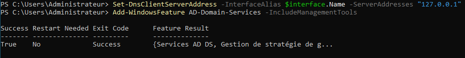
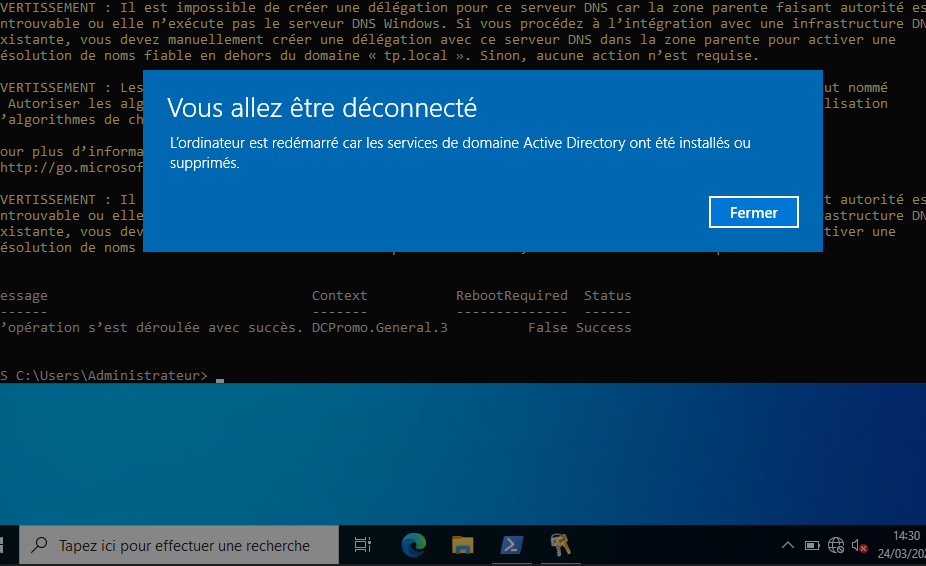
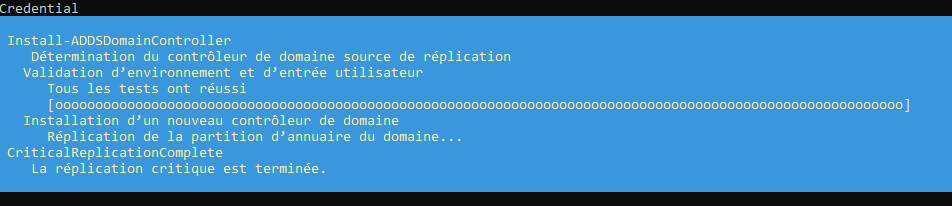

---

## 🏗️ Concepts clés de cette étape

### Qu'est-ce que l'AD DS ?
L'**Active Directory Domain Services** est l'annuaire qui centralise la gestion des utilisateurs et des ordinateurs. C'est le "cœur" du système qui permet l'authentification unique (Single Sign-On).

### Pourquoi la Réplication ?
La réplication entre DC1 et DC2 permet la **haute disponibilité**. Si un serveur tombe, l'autre continue de répondre. Les données sont copiées automatiquement via le réseau entre les deux contrôleurs.

---

---

## 📸 Captures d'écran de l'étape

### Installation et Promotion du Contrôleur de Domaine

*Installation du rôle AD DS sur le premier serveur.*

*Promotion réussie et redémarrage du domaine tp.local.*

### Réplication entre DC1 et DC2

*Vérification de la santé de la réplication sur le second contrôleur.*

---
