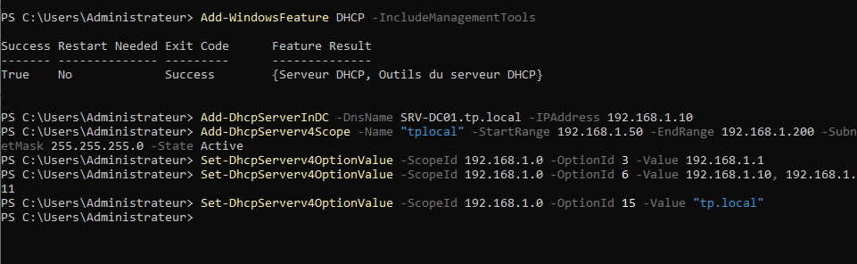

# DHCP (Dynamic Host Configuration Protocol) - Configuration

Le service DHCP est une brique fondamentale pour la gestion automatisée des configurations IP au sein de l'infrastructure.

---

## Concepts clés du DHCP

### Optimisation de l'administration
Dans un réseau d'entreprise, la configuration manuelle des adresses IP s'avère chronophage et source d'erreurs critiques. Le service DHCP automatise l'attribution des paramètres réseau (IP, Masque, Passerelle, DNS) de manière fiable et instantanée lors du démarrage des hôtes.

### Intégration Active Directory et DNS
Le service DHCP est intégré à l'Active Directory. Cette synergie permet une mise à jour dynamique des enregistrements DNS (Dynamic DNS) dès qu'un bail est accordé à un client, garantissant la résolution de noms au sein du domaine.

---

## 1. Installation du rôle
L'installation prépare les fichiers du service sur le serveur.

## 2. Configuration de l'Étendue (Scope)
L'étendue `tplocal` définit les règles de distribution.

---

## Détail des commandes (Justification technique)

| Commande | Justification |
|:--- |:--- |
| `Add-WindowsFeature DHCP -IncludeManagementTools` | Installation du rôle et des outils d'administration console. |
| `Add-DhcpServerInDC` | **Sécurité** : Autorise le serveur dans l'Active Directory. Un serveur non autorisé ne peut pas distribuer de bails, évitant ainsi les déploiements de serveurs DHCP malveillants ("Rogue DHCP"). |
| `Add-DhcpServerv4Scope` | Définition de la plage d'adressage. La plage débute à `.50` pour réserver les premières adresses aux serveurs et équipements d'infrastructure (IP statiques). |
| `Set-DhcpServerv4OptionValue` | Configuration des options transmises aux clients :  • **Option 3** : Passerelle par défaut. • **Option 6** : Serveurs DNS (Contrôleurs de domaine). • **Option 15** : Suffixe DNS du domaine (`tp.local`). |

---
