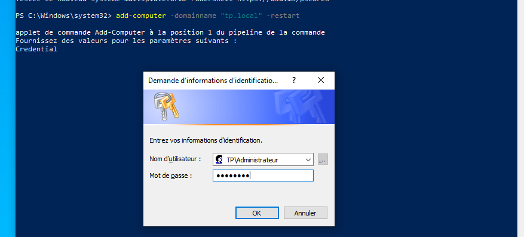
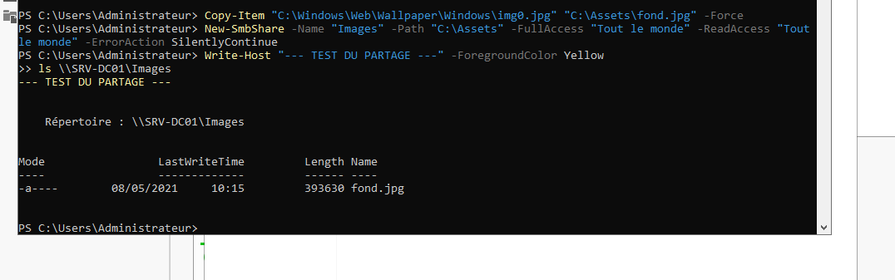

# Intégration du Poste Client (Windows 10)

Ce document explique comment connecter un poste de travail au domaine `tp.local`.

---

## Concepts clés : Pourquoi joindre un domaine ?

Joindre un PC au domaine, ce n'est pas juste le "connecter au réseau". C'est lui dire : "Désormais, tu fais confiance à `SRV-DC01` pour dire qui a le droit de se connecter sur toi".

- **Avantages** : 
  - Centralisation des mots de passe.
  - Application des **GPO** (Stratégies de groupe) pour sécuriser le poste.
  - Accès direct aux fichiers partagés du réseau.

---

## 1. Vérification du DHCP
Avant de joindre le domaine, le PC doit obtenir une configuration réseau valide. Grâce à notre serveur DHCP, le client voit déjà l'identité du réseau.

## 2. Jonction au Domaine (PowerShell)
La jonction se fait via une commande simple, mais elle nécessite d'être "Administrateur" du poste local et de connaître un "Administrateur" du domaine.

## 3. Première Connexion
Une fois redémarré, le poste propose de se connecter. On utilise alors le compte du domaine.

---

## 4. Vérification de la Session et GPO
Une fois connecté, nous vérifions que le client reçoit bien les politiques du serveur.

*Vérification des GPOs appliquées à l'utilisateur Jean Dupont.*

*Accès au partage réseau \\SRV-DC01\Images depuis le client.*

---

## Détail des commandes (Pourquoi et Comment ?)

| Commande | Explication détaillée |
|:--- |:--- |
| `Add-Computer -DomainName "tp.local"` | **L'action principale** : Le client va chercher le DNS, trouver le DC, et lui demander "Est-ce que je peux devenir un membre de ton domaine ?". |
| `-Credential $cred` | **Prouver son droit** : Seul un administrateur du domaine peut autoriser un nouveau PC à entrer. Cette option ouvre la fenêtre pour taper `TP\Administrateur`. |
| `gpresult /r` | **Vérification** : Permet de voir si le PC a bien reçu les "lois" (GPOs) du serveur. |

---
