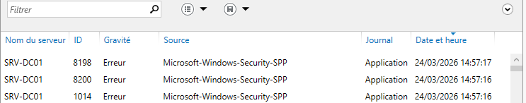
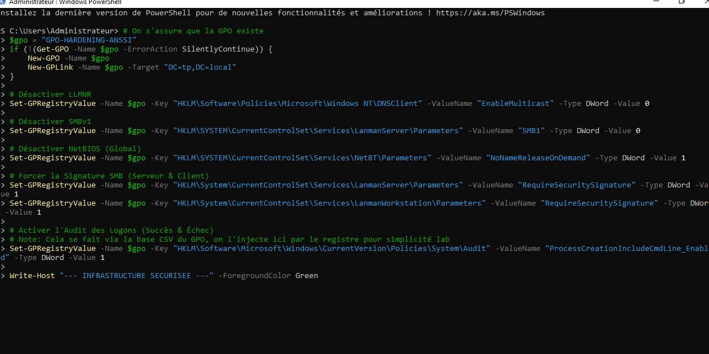
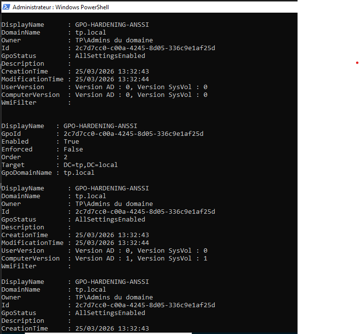

# Sécurité et Hardening

La sécurisation de l'infrastructure est une étape clé pour répondre aux exigences de conformité (ANSSI).

## 1. Pare-feu Windows (Windows Firewall)
Durant la phase de lab, nous avons dû manipuler les profils de pare-feu pour autoriser les flux RPC et DNS nécessaires à la promotion du second DC.

### Dépannage du Pare-feu

## 2. Hardening ANSSI (Durcissement)
Nous avons mis en place une GPO dédiée `GPO-HARDENING-ANSSI` pour verrouiller les protocoles obsolètes.

*Création et liaison de la GPO de sécurité à la racine du domaine.*

| Mesure | Utilité | Risque couvert |
| :--- | :--- | :--- |
| **Désactivation LLMNR** | Coupe la diffusion multidiffusion de noms. | Vol de hash (Empoisonnement DNS). |
| **Désactivation SMBv1** | Désinstalle le vieux protocole de partage. | Ransomwares (WannaCry, Petya). |
| **Désactivation NetBIOS** | Ferme les ports 137/138/139. | Scans réseau et énumération. |
| **Signature SMB Force** | Oblige le "scellage" des paquets réseau. | Interception de fichiers (MITM). |
| **Audit des Connexions** | Journalise les ouvertures de session. | Intrusion et usurpation d'identité. |

*Configuration des clés de registre via PowerShell pour le durcissement.*

---

---

## 🔒 Gestion des Permissions (Partage vs NTFS)

Pour sécuriser un dossier en entreprise, il y a deux "serrures" cumulatives :

1. **Permissions de Partage** : La barrière à l'entrée du réseau. C'est ici que l'on a autorisé "Tout le monde" (Everyone).
2. **Permissions NTFS** (Onglet Sécurité) : C'est le contrôle précis sur les fichiers. C'est ici que l'on peut bloquer certains utilisateurs spécifiques.

### 🛡️ Best Practice (ANSSI)
- **Ne jamais utiliser "Tout le monde"** pour des données sensibles.
- **Utiliser les Groupes de Sécurité** (ex: `G-DIRECTION`) pour donner accès uniquement aux personnes concernées.
- **Mot de passe Administrateur** : Doit être complexe (12+ car.) et partagé uniquement avec les personnes de confiance.

---
