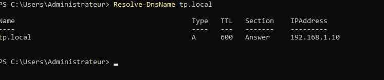
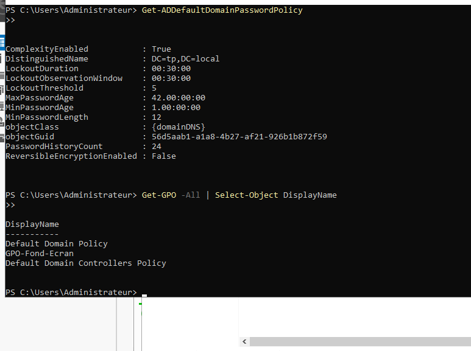
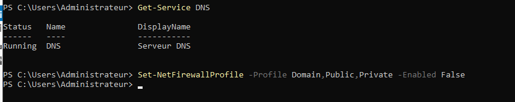

# Validation du Lab

Ce document contient les preuves de succès des tests de connectivité et de réplication.

## 1. Test de Réplication AD
La commande `repadmin /replsummary` permet de confirmer que les données sont synchronisées entre les deux DCs sans erreur.

## 2. Test de Résolution DNS
Le domaine `tp.local` doit pouvoir être résolu par n'importe quelle machine du réseau pointant vers nos serveurs.

## 3. Audit de Santé Post-Incident
Après l'arrêt brutal des VMs, nous avons vérifié l'intégrité de la base AD et des politiques.

*Les politiques de sécurité et les OUs sont restées intactes.*

## 4. Résolution des Problèmes (Troubleshooting)
Durant ce TP, nous avons rencontré un problème d'interconnectivité dû au pare-feu et au type d'adaptateur VirtualBox.

### Firewall Blocking

*Ouverture des flux nécessaires pour l'AD DS.*
